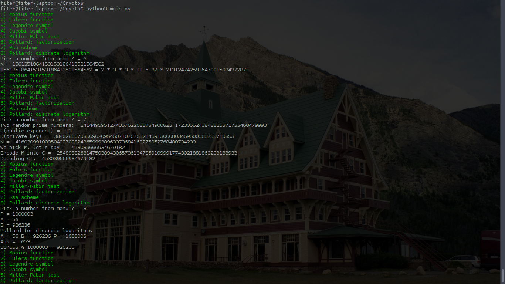

# Number theory and Cryptography class

## Implemented
1) Mobius function
2) Euler's totient function
3) Legendre symbol
4) Jacobi symbol
5) The Miller–Rabin primality test
6) Pollard's rho algorithm for integer factorization
7) RSA
8) Pollard's rho algorithm for logarithms

### How to run
```
python3 main.py
```

### Screenshots

 

